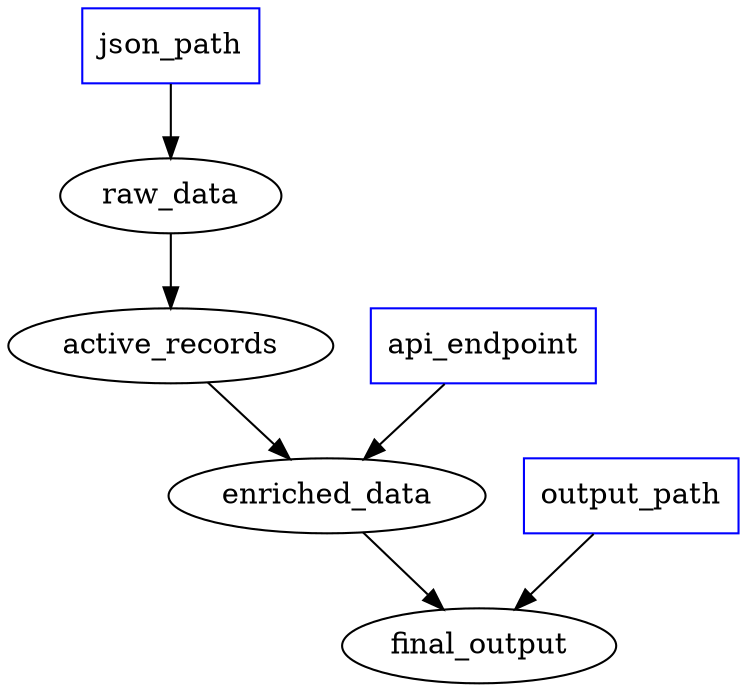

<!--
Licensed to the Apache Software Foundation (ASF) under one
or more contributor license agreements.  See the NOTICE file
distributed with this work for additional information
regarding copyright ownership.  The ASF licenses this file
to you under the Apache License, Version 2.0 (the
"License"); you may not use this file except in compliance
with the License.  You may obtain a copy of the License at

  http://www.apache.org/licenses/LICENSE-2.0

Unless required by applicable law or agreed to in writing,
software distributed under the License is distributed on an
"AS IS" BASIS, WITHOUT WARRANTIES OR CONDITIONS OF ANY
KIND, either express or implied.  See the License for the
specific language governing permissions and limitations
under the License.
-->

---
name: hamilton-dev-workflow
description: Systematic 5-step workflow for building Hamilton DAGs - DOT graphs, signatures, validation, TDD implementation. Use this workflow when creating new Hamilton modules from scratch.
allowed-tools: Read, Grep, Glob, Bash(python:*), Bash(hamilton:*), Bash(pytest:*)
user-invocable: true
disable-model-invocation: false
---

# Hamilton Development Workflow for Claude Code

**TL;DR**: Build Hamilton DAGs systematically using DOT → Signatures → Validation → TDD implementation.

## Why This Workflow?

This workflow optimizes for:
- **Token efficiency**: DOT language is extremely concise
- **Early validation**: Catch graph errors before implementation
- **LLM-friendly**: Well-structured, incremental approach
- **Testability**: Build complex systems node-by-node with tests
- **Pragmatic typing**: Handle type annotations strategically

## The 5-Step Workflow

### Step 1: Natural Language → DOT Graph

**Convert user requirements into DOT language representation**

DOT language is:
- Simple and well-understood by LLMs
- Extremely token-efficient
- Perfect for representing DAG structure
- Easy to validate visually

**Example:**
```
User: "Load CSV data, clean nulls, calculate 7-day rolling average, output top 10"

DOT representation:
digraph hamilton_dag {
    // Inputs
    data_path [shape=box, color=blue]

    // Pipeline (arrows show data flow: upstream -> downstream)
    data_path -> raw_data
    raw_data -> cleaned_data
    cleaned_data -> rolling_7d
    rolling_7d -> top_10
}
```

**Best Practices:**
- Use descriptive node names (snake_case)
- Mark inputs with `[shape=box, color=blue]`
- Add comments for clarity
- Keep it simple - just the graph structure

### Step 2: DOT Graph → Function Signatures + Docstrings

**Convert DOT nodes into Python function signatures**

This step is mechanical and can be automated. For each node:
1. Create a function with the node name
2. Add parameters based on incoming edges
3. Add return type annotation (use `Any` if uncertain)
4. Write a clear docstring explaining what the node computes

**Example:**
```python
"""Data processing pipeline."""
from typing import Any
import pandas as pd

def raw_data(data_path: str) -> pd.DataFrame:
    """Load raw data from CSV file.

    :param data_path: Path to CSV file
    :return: Raw DataFrame
    """
    pass

def cleaned_data(raw_data: pd.DataFrame) -> pd.DataFrame:
    """Remove null values and duplicates.

    :param raw_data: Raw data from previous step
    :return: Cleaned DataFrame
    """
    pass

def rolling_7d(cleaned_data: pd.DataFrame) -> pd.Series:
    """Calculate 7-day rolling average of sales.

    :param cleaned_data: Cleaned data
    :return: 7-day rolling average
    """
    pass

def top_10(rolling_7d: pd.Series) -> pd.Series:
    """Get top 10 days by value.

    :param rolling_7d: Rolling average values
    :return: Top 10 values
    """
    pass
```

**Type Annotation Strategy:**
- **Known types**: Use specific types (pd.DataFrame, pd.Series, int, str)
- **Uncertain**: Use `Any` - you'll fix this later with MonkeyType
- **Complex types**: Start with `Any`, refine incrementally

### Step 3: Validate DAG with Hamilton CLI

**Verify the graph structure before implementing logic**

Use the Hamilton CLI to validate:
```bash
# Validate the DAG structure
hamilton build --module my_pipeline

# Visualize the graph
hamilton build --module my_pipeline --output dag.png

# List all nodes
hamilton build --module my_pipeline --list-nodes
```

**What to check:**
- ✅ No circular dependencies
- ✅ All edges connect properly
- ✅ Input nodes are identified correctly
- ✅ Output nodes are what you expect
- ✅ No typos in function/parameter names

**If validation fails:**
- Fix the function signatures (parameter names, function names)
- Re-run `hamilton build`
- Don't proceed to implementation until validation passes

### Step 4: Function Signatures → TDD Implementation

**Implement nodes incrementally with test-driven development**

This is where the workflow shines for LLMs. Instead of writing all code at once:

**Process:**
1. Pick ONE node to implement (start with inputs, work forward)
2. Write a test for that node first
3. Implement the node to pass the test
4. Run the test to verify
5. Move to the next node

**Example - Node by node:**

```python
# Test for raw_data
def test_raw_data(tmp_path):
    """Test CSV loading."""
    # Setup
    csv_file = tmp_path / "data.csv"
    csv_file.write_text("col_a,col_b\n1,2\n3,4")

    # Execute
    result = raw_data(str(csv_file))

    # Verify
    assert isinstance(result, pd.DataFrame)
    assert len(result) == 2
    assert list(result.columns) == ['col_a', 'col_b']

# Implementation
def raw_data(data_path: str) -> pd.DataFrame:
    """Load raw data from CSV file."""
    return pd.read_csv(data_path)
```

```python
# Test for cleaned_data
def test_cleaned_data():
    """Test data cleaning."""
    # Setup
    raw = pd.DataFrame({
        'col_a': [1, 2, None, 4],
        'col_b': [1, 1, 2, 2]
    })

    # Execute
    result = cleaned_data(raw)

    # Verify
    assert len(result) == 3  # One null removed
    assert result['col_a'].isna().sum() == 0

# Implementation
def cleaned_data(raw_data: pd.DataFrame) -> pd.DataFrame:
    """Remove null values and duplicates."""
    return raw_data.dropna().drop_duplicates()
```

**Why this works:**
- **Focused context**: LLM only thinks about one node at a time
- **Immediate validation**: Each node is tested before moving on
- **Easy refactoring**: Well-tested nodes can be safely refactored
- **Handles complexity**: Build complex pipelines without "spaghetti code"
- **Clear progress**: Know exactly what's done and what's left

### Step 5: Handle Type Annotations Pragmatically

**Use MonkeyType or runtime inference to add accurate types**

Don't spend time guessing types upfront. Instead:

**Option A: Use `Any` everywhere initially**
```python
from typing import Any

def my_function(input_data: Any) -> Any:
    """Process data."""
    # Implementation here
    pass
```

**Option B: Disable type validation in Driver**
```python
from hamilton import driver
from hamilton.lifecycle import base

# Use an adapter that doesn't validate types
class NoTypeCheckAdapter(base.BaseDo):
    """Adapter that skips type validation."""
    pass

dr = driver.Driver(
    {},
    module,
    adapter=NoTypeCheckAdapter()
)
```

**Option C: Run MonkeyType to infer types**

After implementing and testing:
```bash
# Record runtime types
monkeytype run -m pytest tests/

# Generate type stubs
monkeytype stub my_pipeline

# Apply types to source
monkeytype apply my_pipeline
```

MonkeyType will:
- Observe actual values passed at runtime
- Infer concrete types from observations
- Generate accurate type annotations
- Update your source files

**Result**: Accurate types without upfront guessing!

**Important**: MonkeyType isn't perfect, but it's:
- ✅ Much faster than manual annotation
- ✅ Based on real runtime behavior
- ✅ Good enough for first drafts
- ✅ Easy to refine manually later

## Complete Example

**User Request:**
"Create a pipeline that loads JSON data, filters by status='active', enriches with external API data, and outputs to Parquet"

**Step 1: DOT Graph**


**Step 2: Function Signatures**
```python
"""Data enrichment pipeline."""
from typing import Any
import pandas as pd

def raw_data(json_path: str) -> pd.DataFrame:
    """Load data from JSON file.

    :param json_path: Path to JSON file
    :return: Raw DataFrame
    """
    pass

def active_records(raw_data: pd.DataFrame) -> pd.DataFrame:
    """Filter for active status only.

    :param raw_data: Raw data
    :return: Filtered DataFrame
    """
    pass

def enriched_data(active_records: pd.DataFrame, api_endpoint: str) -> pd.DataFrame:
    """Enrich with external API data.

    :param active_records: Active records
    :param api_endpoint: API endpoint URL
    :return: Enriched DataFrame
    """
    pass

def final_output(enriched_data: pd.DataFrame, output_path: str) -> str:
    """Save to Parquet file.

    :param enriched_data: Enriched data
    :param output_path: Output file path
    :return: Path to saved file
    """
    pass
```

**Step 3: Validate**
```bash
hamilton build --module enrichment_pipeline
# Output: ✓ DAG is valid, 4 nodes, 0 cycles
```

**Step 4: TDD Implementation**

*Test 1:*
```python
def test_raw_data(tmp_path):
    json_file = tmp_path / "data.json"
    json_file.write_text('[{"id": 1, "status": "active"}]')
    result = raw_data(str(json_file))
    assert len(result) == 1
```

*Implementation 1:*
```python
def raw_data(json_path: str) -> pd.DataFrame:
    return pd.read_json(json_path)
```

*Test 2:*
```python
def test_active_records():
    raw = pd.DataFrame([
        {"id": 1, "status": "active"},
        {"id": 2, "status": "inactive"}
    ])
    result = active_records(raw)
    assert len(result) == 1
    assert result.iloc[0]["status"] == "active"
```

*Implementation 2:*
```python
def active_records(raw_data: pd.DataFrame) -> pd.DataFrame:
    return raw_data[raw_data["status"] == "active"]
```

...continue for each node...

**Step 5: Add Types with MonkeyType**
```bash
monkeytype run -m pytest tests/
monkeytype apply enrichment_pipeline
```

Result: Accurate type annotations added automatically!

## Key Benefits of This Workflow

### For LLMs (Claude):
- **Structured thinking**: Each step has clear boundaries
- **Token efficient**: DOT is concise, avoids redundant code
- **Incremental**: Build one piece at a time
- **Validatable**: Check work at each step
- **Manageable complexity**: Never overwhelmed with full implementation

### For Developers:
- **Visual validation**: See the DAG before coding
- **Test coverage**: Every node is tested
- **Maintainable**: Well-structured, documented code
- **Debuggable**: Issues isolated to specific nodes
- **Refactorable**: Safe to modify with test coverage

## Advanced Patterns

### Using Function Modifiers

Add decorators in Step 2:

```python
from hamilton.function_modifiers import parameterize

@parameterize(
    rolling_7d={'window': 7},
    rolling_30d={'window': 30},
    rolling_90d={'window': 90},
)
def rolling_average(data: pd.Series, window: int) -> pd.Series:
    """Calculate rolling average.

    :param data: Input data
    :param window: Rolling window size
    :return: Rolling average
    """
    pass
```

Update DOT graph to reflect expanded nodes:
```dot
data -> rolling_7d
data -> rolling_30d
data -> rolling_90d
```

### Async Functions

Mark async in Step 2:

```python
async def api_data(endpoint: str, record_id: int) -> dict:
    """Fetch data from API.

    :param endpoint: API endpoint
    :param record_id: Record ID to fetch
    :return: API response data
    """
    pass
```

Use async driver:
```python
from hamilton import async_driver

dr = await async_driver.Builder().with_modules(module).build()
```

## Common Pitfalls

### ❌ Implementing before validating
Don't write function bodies before running `hamilton build`. Validate structure first!

### ❌ Writing all code at once
Don't implement all nodes before testing. Go node-by-node with TDD.

### ❌ Guessing type annotations
Don't waste time guessing types. Use `Any` + MonkeyType or disable validation initially.

### ❌ Skipping the DOT step
Don't jump straight to code. The DOT graph is your blueprint - validate it first.

### ❌ Not running tests
Don't implement the next node until the current one passes its test.

## Quick Reference

```bash
# Step 3: Validate DAG
hamilton build --module my_module
hamilton build --module my_module --output dag.png

# Step 4: Run tests
pytest tests/test_my_module.py::test_my_function -v

# Step 5: Infer types
monkeytype run -m pytest tests/
monkeytype apply my_module

# Full pipeline validation
python -c "from hamilton import driver; import my_module; driver.Driver({}, my_module)"
```

## Summary

1. **DOT first**: Design the graph in DOT language (token-efficient, validatable)
2. **Signatures next**: Convert to function signatures with docstrings
3. **Validate early**: Use `hamilton build` before implementing
4. **TDD everything**: Implement one node at a time with tests
5. **Types pragmatically**: Use Any + MonkeyType or disable validation initially

**This workflow enables Claude to build complex Hamilton DAGs systematically, avoiding the pitfalls of monolithic implementation.**

---

For additional patterns and examples, see the skill-specific guides:
- `/hamilton-core` - Core patterns and decorators
- `/hamilton-scale` - Async, Ray, Dask, Spark
- `/hamilton-llm` - LLM and RAG workflows
- `/hamilton-observability` - Monitoring and tracking
- `/hamilton-integrations` - Airflow, FastAPI, Streamlit
