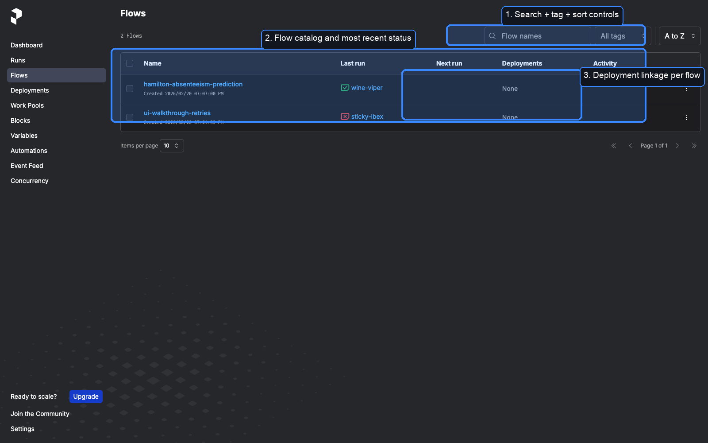
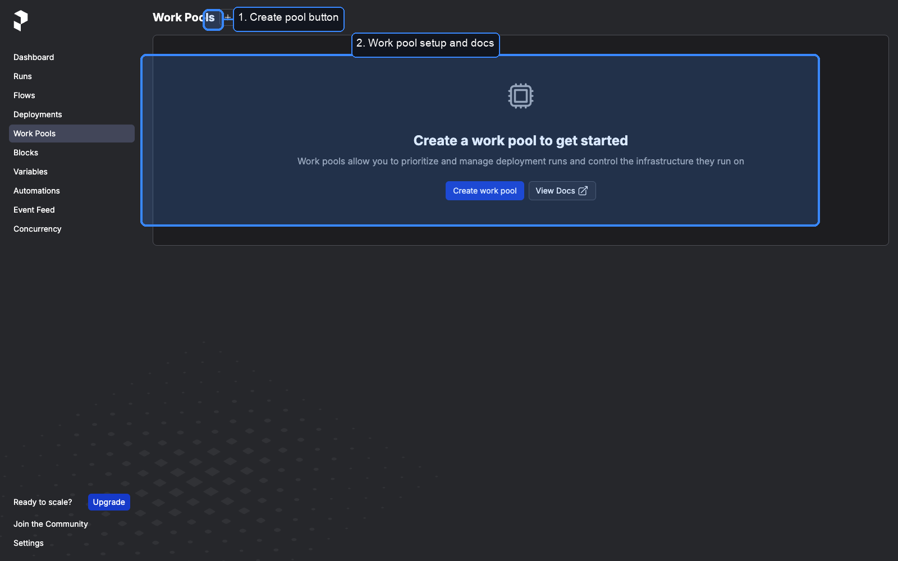
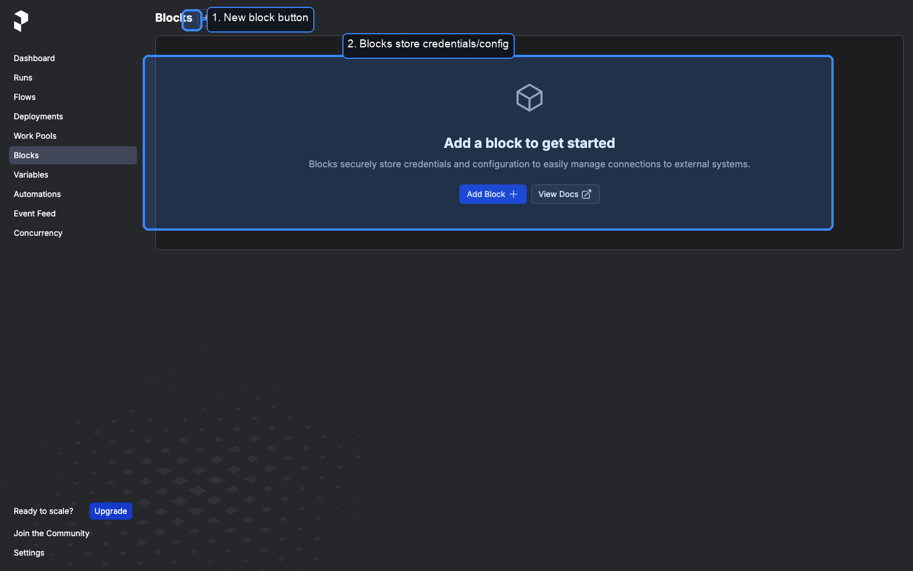
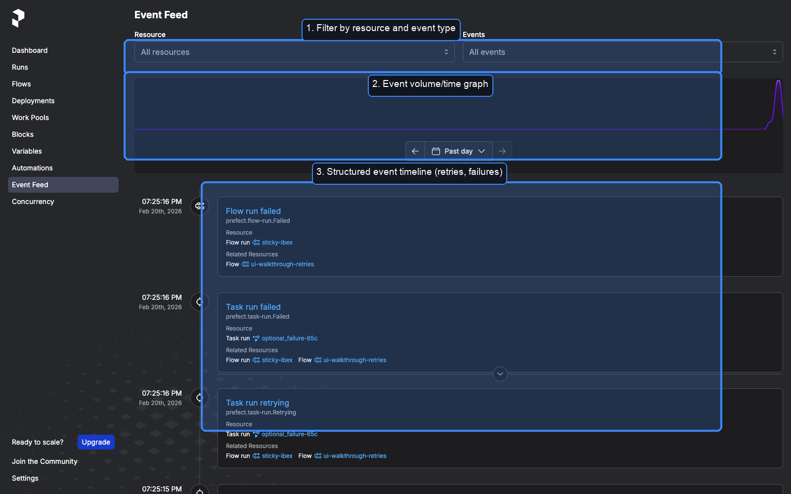
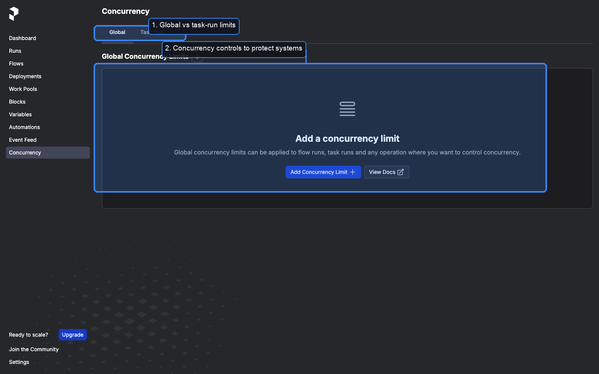
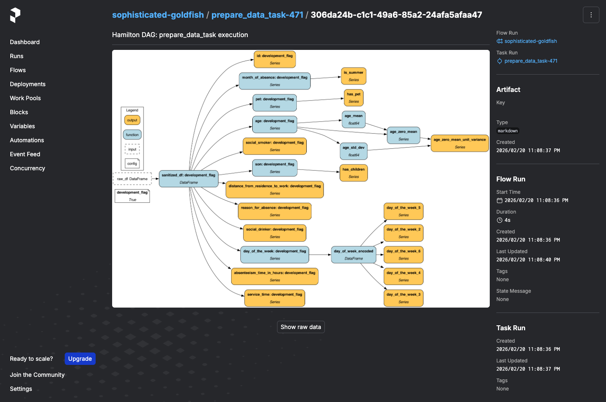

# Prefect UI Walkthrough (Local Server)

This walkthrough is based on local Prefect server UIs on `http://127.0.0.1:4210` and `http://127.0.0.1:4200`.

## Context Used For Screenshots

- Prefect version: `3.6.18`
- Demo flow: `ui-walkthrough-retries`
- Demo runs:
1. Success after retries: `outrageous-wolverine` (`eac8a568-7475-46fb-9760-f14232f39130`)
2. Failed after retry exhaustion: `sticky-ibex` (`8d97cd9a-c35f-4f97-a1fb-57b251504065`)
3. Hamilton artifact detail examples: `sophisticated-goldfish` (`b9df7cde-e0e0-43c0-b511-b5f86d27f711`)

## 1) Dashboard


What this page gives you:
1. Fast global navigation for all control surfaces.
2. Flow run health at a glance.
3. Task success/failure trend over time.
4. Work pool snapshot so you can spot missing execution infrastructure quickly.

## 2) Runs (Operational Triage)


Use this page to:
1. Filter by time/state/flow/work pool/tags.
2. Spot spikes in runtime/failure in the trend chart.
3. Jump into specific runs, parameters, and task counts.

## 3) Run Detail (Successful Retry Path)


What to inspect for retries:
1. Run state and elapsed time at the top.
2. Task Gantt bars to see sequencing and timing.
3. Tabs for logs, task runs, parameters, artifacts.
4. Logs showing retry transitions and eventual success.

## 4) Run Detail (Failure + Retry Exhaustion)


What this shows:
1. Clear failed terminal state.
2. Failure window in the timeline.
3. Specific failed task highlighted.
4. Logs that explain why retries were exhausted.

## 5) Flows Catalog



What you get:
1. Search/tag/sort for discoverability.
2. Per-flow latest status.
3. Visibility into deployment linkage status.

## 6) Deployments (Scheduling + Remote Triggers)


Deployments are how you move from manual runs to managed, schedulable runs.

Live example in this environment:
1. `absenteeism-local` deployment is registered and ready.
2. It has an hourly schedule attached.
3. The activity sparkline shows recent execution history.

## 7) Work Pools (Execution Infrastructure)



Work pools let you control where deployments run.

Typical flow:
1. Create pool (local/process/container/k8s depending on setup).
2. Start worker(s) bound to that pool.
3. Deploy flows into that pool.

## 8) Blocks (Secrets + Reusable Config)



Use blocks to store reusable credentials/config for external systems (cloud stores, APIs, infra settings).

## 9) Variables (Runtime Non-Secrets)


Use variables for non-sensitive runtime values you want editable without code changes.

## 10) Automations (Event-Driven Actions)


Automations react to events like failures/completions and can trigger actions (notifications, follow-up runs, etc.).

## 11) Event Feed (Audit + Root Cause Trail)



Event feed provides:
1. Filterable event stream.
2. Event volume/time visibility.
3. Rich timeline linking retries/failures to concrete run and task objects.

This is one of the fastest ways to reconstruct incident timelines.

## 12) Concurrency Controls



Concurrency limits help protect shared systems and external dependencies.

Use cases:
1. Global throttling across many flows.
2. Task-run limits for expensive or rate-limited operations.

## 13) Artifact Detail (Model Results)


This screenshot shows an opened artifact detail page (from `Artifacts` in a run):
1. Artifact content is readable directly in UI (no log scraping required).
2. Right-side metadata panel links artifact to exact flow run + task run.
3. Same workflow supports table/markdown/progress artifacts for operational debugging.

Artifacts shown in this run came from:
1. `create_table_artifact(...)` for data preview.
2. `create_markdown_artifact(...)` for summaries/results.
3. `create_progress_artifact(...)` and `update_progress_artifact(...)` for live-ish status.
4. `dr.visualize_execution(...)` + `create_markdown_artifact(...)` for Hamilton DAG visibility.

## 14) Hamilton DAG Visibility Inside Prefect



For runs of this flow, the walkthrough now publishes two Hamilton DAG artifacts:
1. `Hamilton DAG: prepare_data_task execution`
2. `Hamilton DAG: train_and_evaluate_model_task execution`

Where to find them in UI:
1. Open a run under `hamilton-absenteeism-prediction`.
2. Go to `Artifacts`.
3. In task artifact cards, open the markdown cards whose description starts with `Hamilton DAG: ...`.
4. The card body renders the embedded DAG PNG, giving you Hamilton internals inside the Prefect run page.

What this gives you:
1. Prefect timeline/state visibility for macro orchestration.
2. Hamilton graph visibility for micro dependency structure inside each task.
3. A concrete bridge for "why did this task run this way?" without leaving Prefect.

## 15) Airflow TaskFlow vs Prefect (Practical)

If you already used Airflow TaskFlow, the coding model feels similar. The largest differences are operational, not decorator syntax.

| Area | Airflow TaskFlow | Prefect |
| --- | --- | --- |
| Authoring model | Python functions with `@task` in DAG context | Python functions with `@task` inside `@flow` |
| Registration model | Scheduler discovers DAG files | Deployments explicitly register runnable entrypoints |
| Execution pull/push | Scheduler/executor-centric | Worker pulls from API/work pool |
| Run from UI | DAG is always triggerable once discovered | UI-triggerable when deployment exists |
| Retry semantics | Task retries in DAG/task config | Task retries in decorator; flow-level state is explicit in UI |
| Observability | Logs + graph + task instances | Logs + timeline + task runs + event feed + artifacts |
| Parameterized reruns | Trigger DAG run with conf | Deployment run with parameters/job vars |
| Infra binding | Executors/queues | Work pools + workers |

How this maps to this walkthrough:
1. The early "empty Deployments page" behavior is expected for ad-hoc local runs.
2. Once `absenteeism-local` deployment exists, Prefect behaves much closer to the Airflow control-plane experience.
3. Prefect `Artifacts` add structured outputs (table/markdown/progress) directly in run detail.
4. Hamilton DAG artifacts complement Prefect by exposing internal variable lineage per task.

## Deployment Setup Commands (Used Here)

```bash
# 1) Create a local process pool
PREFECT_API_URL=http://127.0.0.1:4210/api \
uv run --no-project --with prefect prefect work-pool create local-process --type process

# 2) Create deployment for the Hamilton tutorial flow
PREFECT_API_URL=http://127.0.0.1:4210/api \
uv run --no-project --with prefect --with numpy --with pandas --with scipy --with scikit-learn --with 'sf-hamilton[visualization]' \
prefect deploy ./run.py:absenteeism_prediction_flow -n absenteeism-local -p local-process --interval 3600 --timezone America/Los_Angeles

# 3) Start worker
PREFECT_API_URL=http://127.0.0.1:4210/api \
uv run --no-project --with prefect --with numpy --with pandas --with scipy --with scikit-learn --with 'sf-hamilton[visualization]' \
prefect worker start --pool local-process

# 4) Trigger run from deployment
PREFECT_API_URL=http://127.0.0.1:4210/api \
uv run --no-project --with prefect \
prefect deployment run 'hamilton-absenteeism-prediction/absenteeism-local'
```

## Retry Demo Configuration Used

The retries shown in screenshots came from this pattern:

```python
@task(name="flaky_transform", retries=2, retry_delay_seconds=1)
def flaky_transform(x: int) -> int: ...

@task(name="optional_failure", retries=1, retry_delay_seconds=1)
def optional_failure(should_fail: bool) -> str: ...
```

And a flow parameter:

```python
@flow(name="ui-walkthrough-retries")
def ui_walkthrough_retries(should_fail: bool = False): ...
```

## Command Used To Generate Demo Runs

```bash
PREFECT_API_URL=http://127.0.0.1:4210/api \
uv run --with prefect python /tmp/prefect_ui_walkthrough_demo.py
```

## Practical "What Prefect Can Do" Summary

1. Run orchestration with clear run/task state tracking.
2. Automatic retries with configurable delay and retry count.
3. Deep logs, timelines, and event-level auditability.
4. Deployments for scheduling and remote/API-triggered execution.
5. Work pools and workers to control execution environment.
6. Secure config/secrets via Blocks and mutable runtime config via Variables.
7. Event-driven Automations for reactive operations.
8. Concurrency/rate controls to protect downstream systems.
